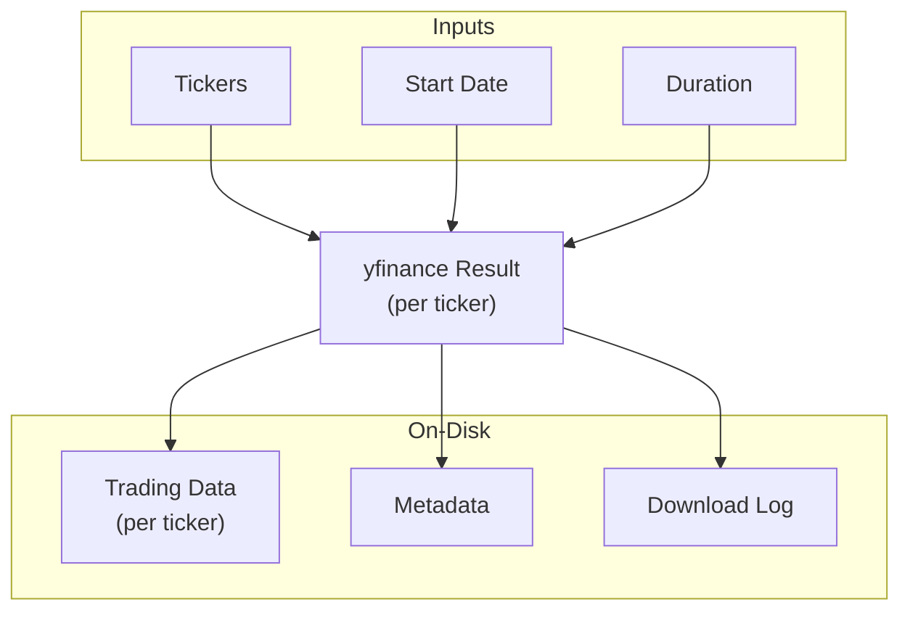
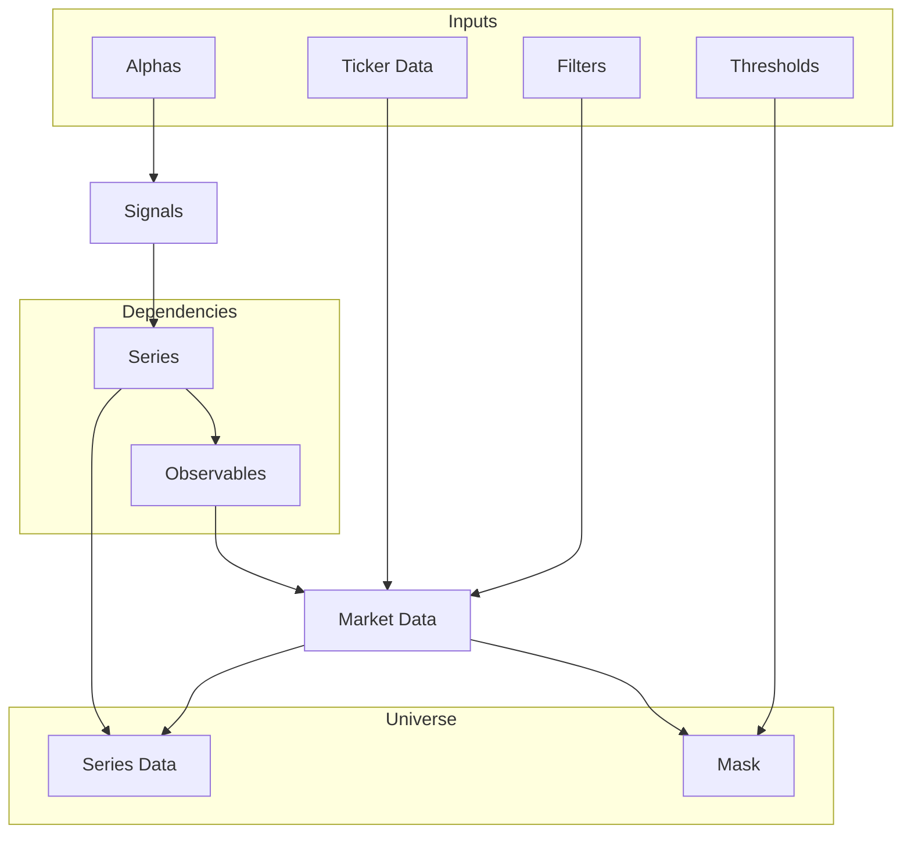
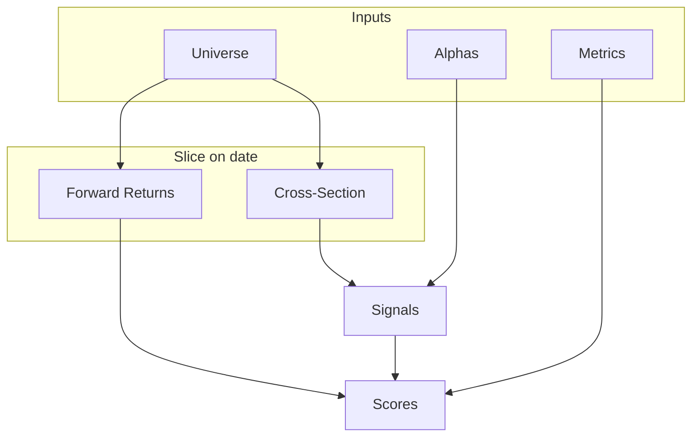

# Architecture

## Overview

The framework is organised around a strict separation of computational domains:

```text
Raw market data
      │
      v
 Observable
      │
      v
    Series        temporal / time × ticker operations
      │
      v
    Signal        cross-sectional operations
      │
      v
     Alpha        signal + research metadata / hypothesis
      │
      v
    Metric        signal vs realised forward return
```

The layers are all built from stateless operators represented as Python classes.

The framework has three major execution stages:
- **Download** daily per-ticker stock data (via yfinance) to disk.
- **Build** a session-scoped temporarily disk-backed Universe.
- **Evaluate** the cross-sectional predictive power of alpha signals with an array of metrics.

## Directory Structure
```
alpha_research_framework/
├── alphas/                     # Template for defining new alphas & selection of built-in alphas
├── download/                   # Stock data retrieval process
├── metrics/                    # Selection of built-in metrics
├── observables/                # Defines strongly-typed representations of raw market data
├── series/                     # Framework for defining new market series & selection of built-in series
├── signals/                    # Framework for defining new cross-sectional signals & selection of built-in signals
├── universe/                   # Universe building logic & container functionality
└── evaluate.py                 # Alpha evaluation process
```

## Computational Domains

### Observable: raw market quantities

`Observable` is the boundary between downloaded data and the research expression system.

The current built-in observables are:

- adjusted open
- adjusted high
- adjusted low
- adjusted close
- volume

An `Observable` is represented by a class with a `NAME` identifying its column in the per-ticker downloaded data.

Observables do not perform calculations. They identify raw inputs.

---

### Series: temporal calculations

A `Series` acts on the market data and produces a time-series. Series are the only layer that directly performs temporal
operations. They can be:

- `ObservableSeries` - Maps directly to an `Observable`.
- `TransformedSeries` - Applies a transform to another `Series` (for example logarithms, shifts and rolling
statistics).
- `CombinedSeries` - Combines two `Series` through arithmetic.

Examples:

```text
Close
  │
  ├── LogClose
  │     │
  │     ├── LogCloseLag20d
  │     │
  │     └── Returns20d
  │
  ├── RollingAvgClose20d
  └── RollingStdClose20d
```

---

### Signal: cross-sectional calculations

A `Signal` acts on the cross-section and produces a one-dimensional quantity (one value per ticker). They can be:

- `SeriesSignal` - Maps directly to a `Series`.
- `CombinedSignal` - Combines two `Signals` through arithmetic.
- `NegatedSignal` - Applies a negation to another `Signal`.

A `Signal` therefore has no need to know about the complete time history. Historical requirements have already been
resolved into `Series` by the time the `Signal` is evaluated.

---

### Alpha: research hypothesis

`Alpha` is the research-facing wrapper around a `Signal`. It adds no mutable state; its purpose is to give a `Signal` a
stable identity, category and set of prediction horizons.

---

### Metric: evaluation

A `Metric` acts on two aligned cross-sectional arrays:

```text
signal
forward_returns
```

and produces either one scalar or several named values that quantify their relationship.

---

## API Execution Flows

### `arf.download(...)`

Each successful ticker receives a Parquet file containing adjusted OHLC values and volume. Static ticker metadata is stored centrally in `metadata.json`.



### `arf.build_universe_for(...)`

Builds a `Universe` instance containing all required data to evaluate the input alphas.



### `arf.evaluate(...)`

Iterates through a `Universe`'s dates and generates values quantifying the predictive power of all input alphas.



## Data Model

### Core Data Types

---

#### `Scalar`

Typedef for datatype used in all arrays.

Type: `np.float64`

---

#### `md.Array`

Format for all stores of market-like data.

Type: `np.memmap`

Shape: `(trading days, tickers)`

dtype: `Scalar`

---

#### `md.MarketData`

3D representation of the stock market.

Type: `dict[type[observables.Observable], md.Array]`

---

#### `xs.Array`

Format for all stores of cross-sectional data.

Type: `np.ndarray`

Shape: `(tickers,)`

dtype: `Scalar`

---

#### `xs.CrossSection`

2D snapshot of a `Universe` at a single timestamp.

Type: `dict[type[series.Feature], xs.Array]`

---

### Data Containers

---

#### `Universe`

Read-only bridge between disk-backed historical data and cross-sectional evaluation.

Contains: time $\times$ ticker series data & in-universe mask.

Access: indexing by `pd.Timestamp`.

---

## Design Choices

### Class-driven design

The framework deliberately represents concrete research concepts as types rather than instances.

For example, there is one class representing `series.Returns1d`, not a collection of `Series` instances each carrying
its own state. An expression such as:

```python
signals.Returns252d - signals.Returns20d
```

creates a concrete `Signal` type describing that expression.

This approach provides two useful properties:
- **Uniqueness** - The framework avoids maintaining many equivalent runtime objects representing the same expression.
- **Registration** - Concrete concepts can be registered at compile-time and then referenced purely by ID at runtime.

### Registries & IDs

`Registrable` provides class-level registries for framework concepts such as Alphas and Metrics.

Concrete classes expose an `ID` and can consequently be supplied to public APIs either as a type or as its registered ID:

```python
arf.evaluate(universe, [arf.alphas.Momentum12m1m])
```

or:

```python
arf.evaluate(universe, ["momentum_12m_1m"])
```

### Dependency graphs

The framework handles an alphas dependencies via a DAG. Conceptually:

```text
Requested Alphas
      │
      v
Requested Signals
      │
      v
Required Series
      │
      v
Required Observables
```

This means adding a new `Alpha` does not require a declaration of its raw market-data dependencies. Everything is
deduced purely from the `Signal` that the `Alpha` defines.

### Horizon Phases

`Alpha` evaluation is deliberately phase-aligned. A horizon $h$ is evaluated only on dates whose zero-based position
$t$ satisfies:

```python
t % h == 0
```

This means, for example, that a 20-trading-day forward-return horizon is not evaluated on every trading day. The design
avoids creating a sequence of highly overlapping observations when measuring the predictive relationship at a given
horizon.

### Large datasets

The framework can handle almost arbitrarily large datasets. Market-like data (those with entries per ticker per
timestamp) are stored as `np.memmap` instances, and manual changes to those are streamed from and buffered back to avoid
materialisation into RAM at any point.